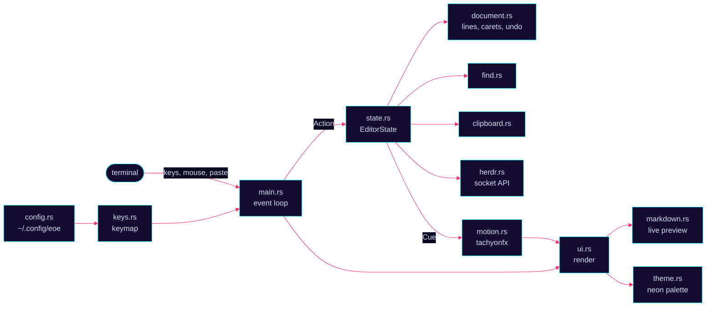

<div align="center">


# Eric's Own Editor

**A keyboard-first plain-text editor that boots like a movie hack.**<br>
The project is `eoe`, the command is `ee`. Type it, jack in, edit text in neon.

<a href="#jack-in"></a>
<a href="https://ratatui.rs"></a>
<a href="https://github.com/ratatui/tachyonfx"></a>
<a href="https://omarchy.org"></a>
<a href="#send-lines-to-herdr"></a>

<kbd>[jack in](#jack-in)</kbd>&nbsp;
<kbd>[what it does](#what-it-does)</kbd>&nbsp;
<kbd>[keys](#keys)</kbd>&nbsp;
<kbd>[config](#config)</kbd>&nbsp;
<kbd>[under the hood](#under-the-hood)</kbd>&nbsp;
<kbd>[faq](#faq)</kbd>

</div>

```diff
+ [ ok ] mounting buffers
+ [ ok ] calibrating neon
+ [ ok ] ignoring your opinions
- [ -- ] plugin system not found (by design)
```

`ee` is a plain-text editor for the terminal, built for [Omarchy](https://omarchy.org) and for people with WebStorm in their fingers. It does multi-cursor editing, renders markdown live while you write it, sends lines to the agent or shell next to it in [herdr](https://herdr.dev), and animates every move with [tachyonfx](https://github.com/ratatui/tachyonfx). It keeps your terminal's own background, so Omarchy's blur shows through the neon.


## Jack in

```sh
curl -fsSL https://raw.githubusercontent.com/uxeric/ee/HEAD/install.sh | bash
```

The installer builds `ee` from source and installs it for you, no root needed. Run the same command again to update: it pulls the latest source, rebuilds, and tells you which version it updated from and to. If you're already up to date it says so and skips the build, and your config is never touched.

1. **Rust:** it checks for Rust 1.91 or newer. If Rust is missing, it asks before installing it: on Omarchy with Omarchy's own `omarchy-install-dev-env rust`, elsewhere with `pacman` or [rustup](https://rustup.rs).
2. **Source:** it downloads the source into `~/.local/share/eoe/src`, or builds the checkout it's run from.
3. **Binary:** it compiles a release build and installs it as `~/.local/bin/ee`.
4. **Config:** it writes a commented `~/.config/eoe/config.toml`, but only if you don't have one. Your config is never overwritten.
5. **Omarchy:** on Omarchy it also adds `ee`, with its own icon, to the app launcher (<kbd>Super</kbd>+<kbd>Space</kbd>, then type `ee`) through `omarchy-tui-install`, so it opens tiled in your terminal like any other Omarchy TUI. Updating an older install replaces its "Eric's Own Editor" entry.
6. **PATH:** it warns if `~/.local/bin` isn't on your `PATH`, or if another `ee` comes first (hello, Easy Editor).

You need a terminal that passes `Ctrl` and `Alt` through: Alacritty, kitty, Ghostty, foot and WezTerm all do.

<details>
<summary><b>From a clone, uninstalling, and installer settings</b></summary>

```sh
./install.sh                          # build and install this checkout
./install.sh --force                  # rebuild even if ee is already up to date
./install.sh --uninstall              # remove ee (and its Omarchy launcher entry), keep your config
./install.sh --uninstall --purge      # remove ee and your config
curl -fsSL https://raw.githubusercontent.com/uxeric/ee/HEAD/install.sh | bash -s -- --uninstall
```

| Variable | Default | What it sets |
|---|---|---|
| `EOE_PREFIX` | `~/.local` | Install prefix; `ee` goes in `$EOE_PREFIX/bin` |
| `EOE_REPO` | `https://github.com/uxeric/ee.git` | Where to download the source from |
| `EOE_REF` | the default branch | The branch or tag to build |
| `EOE_SOURCE_DIR` | | Build this directory instead of downloading |
| `EOE_YES=1` | | Answer yes to prompts, such as installing Rust |
| `EOE_NO_OMARCHY=1` | | Skip the Omarchy integration: no launcher entry, and Rust comes from `pacman` or rustup |

Omarchy's own default-editor setting (`omarchy-default-editor`) only accepts a fixed list of editors, so the installer doesn't set `ee` there.

Prefer doing it by hand? `cargo build --release && install -Dm755 target/release/ee ~/.local/bin/ee`.

</details>

Then run `ee notes.md`. If the file doesn't exist yet, `ee` opens it empty and the first save creates it. `Ctrl+Q` quits, and asks for a second press if something is unsaved. `EOE_NO_FX=1 ee` turns off every animation.

**Staying up to date.** `ee` opens straight into your files. In the background it checks whether a newer version has been pushed. If there is one, a small popup offers it: <kbd>Enter</kbd> restarts into the update, and <kbd>Esc</kbd> keeps working. It won't restart over unsaved changes. You can also update by hand:

```sh
ee --update      # download, build and install the latest version
ee --version     # the installed version
```

`EOE_NO_UPDATE_CHECK=1` turns the background check off.


## What it does

### Markdown that renders while you write it

In `.md` files, every line is shown rendered except the lines you're editing. The caret's line, and any line in a selection, show their raw source, so you always edit the real text. One source line is always one row, so nothing jumps around.

- **Headings** lose their `#`s and take a colour per level.
- **Bold**, *italic*, ~~strikethrough~~ and `code` lose their markers; links show only their text.
- **Lists** get `•` `◦` `▪` bullets by depth; tasks become `□` and `✓`.
- **Quotes** get a `▌` bar, rules become a full-width line, and fenced code gets a labelled rule over a tinted body.
- **Tables** line up. Columns follow `:---`, `:---:` and `---:` alignment, and columns of numbers right-align on their own. The header sits on a violet band over a double cyan rule, and body rows are zebra-striped.
- **Alerts** (`> [!NOTE]`, `[!TIP]`, `[!IMPORTANT]`, `[!WARNING]`, `[!CAUTION]`) become coloured callouts with an icon and a label.
- **Code blocks** are highlighted by language: shell, TOML, Rust, Python, JavaScript and more. In `diff` blocks, added lines are cyan and removed lines magenta.
- **HTML** the way GitHub shows it: `<kbd>` as keycaps; `<b>`, `<i>`, `<code>`, `<sub>` styled; `<summary>` as a `▸` header; `<div align="center">` content centred. `<br>`, comments and wrapper tags disappear.
- **Images** become a `◩ alt text` placeholder, and a decorative image with an empty `alt` becomes a thin rule. Shields.io badges are drawn as two-tone text badges in their own colours, without any network access.

`Alt`+Click on a rendered line lands on the character you clicked. `Ctrl`+Click on a link follows it: `#anchors` jump to that heading, relative paths open in a new tab (`other.md#section` jumps too), and web links open in your browser. The recording at the top is a real session: `- [ ] jack out` is typed raw and becomes a checkbox the moment the caret moves on; then <kbd>Ctrl</kbd>+<kbd>F12</kbd> lists the headings, typing `cr` finds *Crew*, and <kbd>Ctrl</kbd>+<kbd>Alt</kbd>+<kbd>←</kbd> jumps back.

### Many carets, one keystroke

<p align="center"></p>

`Ctrl+Up` and `Ctrl+Down` leave a caret behind; `Alt`+Click adds one anywhere. Typing, deleting and pasting a single line happen at every caret, and the arrow keys move them all. `Alt+Shift+J` puts a caret on every copy of the word under the caret, so typing replaces them all at once. `Esc` goes back to one caret.

### Send lines to herdr

With [herdr](https://herdr.dev) running, `Alt+Shift+E` sends the caret's line to a herdr pane and presses Enter. With several carets, it sends every caret's line, top to bottom, as one paste. If herdr sees an agent such as Claude in that pane, the lines arrive as a prompt.

- **Inside herdr:** the lines go to the other pane in `ee`'s tab. If the tab has several, `ee` tries the neighbour to the right, then left, below and above. It never sends to its own pane or to other tabs.
- **Outside herdr** (`ee` in a plain terminal): the lines go to whichever herdr pane is focused.
- **No herdr running:** the status bar says so and nothing is sent.

The sent lines answer back: a magenta write head sweeps each one, breaking it into `▓▒░` data blocks, and the text re-forms in cyan behind it.

### Find as you type

<p align="center"></p>

`Ctrl+F` searches the file as you type, and every match lights up. `Shift` `Shift` (tap it twice) or `Alt+Shift+F` searches every open tab. `Ctrl+R` adds a Replace field. `Esc` closes the bar and leaves the match selected, so typing replaces it, and `F3` keeps going afterwards.

### Motion that answers what you do

<p align="center"></p>

| When | What you see |
|---|---|
| Starting up | The editor jacks in behind a neon scan (it never holds up your typing) |
| A popup opens (actions, file structure, open file) | It decodes into view |
| An update is ready | The popup decodes in behind a neon scan |
| Switching tabs | The new tab's text sweeps in from the direction you moved |
| Opening a file | The text decodes in with a cyan glow |
| Jumping to a match | The match flashes magenta |
| Opening the find bar | The bar sweeps in |
| Saving | A cyan beam crosses the status bar |
| Sending to herdr | Each sent line is packetized by a magenta write head and re-forms in cyan |
| A warning | The status bar flashes amber |
| An error | The status bar glitches red |
| Quitting | The screen dissolves |

The badge at the bottom left says where your typing goes: `edit`, `find`, `find in files`, `replace` or `prompt`. The editor only redraws while an effect runs, so it uses no CPU when idle. `EOE_NO_FX=1` turns all of it off.


## Keys

Terminals can't tell `Ctrl+X` from `Ctrl+Shift+X`, so WebStorm's `Ctrl+Shift+letter` actions live on the plain `Ctrl+letter` key. Where that key was taken, the action moved to `Alt+Shift+letter`. Most `Ctrl` keys also answer to `Alt`, which you can turn off in the [config](#config).

### Cheat sheet

| Action | Keys | Action | Keys |
|---|---|---|---|
| Save all | <kbd>Ctrl</kbd>+<kbd>S</kbd> | Find | <kbd>Ctrl</kbd>+<kbd>F</kbd> |
| Undo / redo | <kbd>Ctrl</kbd>+<kbd>Z</kbd> / <kbd>Alt</kbd>+<kbd>Y</kbd> | Find in all tabs | <kbd>Shift</kbd> <kbd>Shift</kbd> |
| Copy / cut / paste | <kbd>Ctrl</kbd>+<kbd>C</kbd> <kbd>X</kbd> <kbd>V</kbd> | Replace | <kbd>Ctrl</kbd>+<kbd>R</kbd> |
| Add caret below | <kbd>Ctrl</kbd>+<kbd>↓</kbd> | Next / previous tab | <kbd>Ctrl</kbd>+<kbd>]</kbd> / <kbd>Ctrl</kbd>+<kbd>[</kbd> |
| Duplicate line | <kbd>Ctrl</kbd>+<kbd>D</kbd> | Open file | <kbd>Ctrl</kbd>+<kbd>N</kbd> |
| Extend selection | <kbd>Ctrl</kbd>+<kbd>W</kbd> | Move by word | <kbd>Ctrl</kbd>+<kbd>←</kbd> <kbd>→</kbd> |
| Command palette | <kbd>Ctrl</kbd>+<kbd>Shift</kbd>+<kbd>A</kbd> / <kbd>Alt</kbd>+<kbd>Shift</kbd>+<kbd>A</kbd> | File structure | <kbd>Ctrl</kbd>+<kbd>F12</kbd> |
| Select all | <kbd>Ctrl</kbd>+<kbd>A</kbd> | Toggle comment | <kbd>Ctrl</kbd>+<kbd>/</kbd> |
| Go to line | <kbd>Ctrl</kbd>+<kbd>G</kbd> | Back / forward | <kbd>Ctrl</kbd>+<kbd>Alt</kbd>+<kbd>←</kbd> <kbd>→</kbd> |
| Indent / unindent | <kbd>Tab</kbd> / <kbd>Shift</kbd>+<kbd>Tab</kbd> | Start new line | <kbd>Shift</kbd>+<kbd>Enter</kbd> |
| Send to herdr | <kbd>Alt</kbd>+<kbd>Shift</kbd>+<kbd>E</kbd> | Quit | <kbd>Ctrl</kbd>+<kbd>Q</kbd> |

<details>
<summary><b>Editing and movement</b></summary>

| Action | Primary | Fallback |
|---|---|---|
| Quit (press twice if there are unsaved changes) | <kbd>Ctrl</kbd>+<kbd>Q</kbd> | <kbd>Alt</kbd>+<kbd>Q</kbd> |
| Insert char | typed char | — |
| Paste from the terminal | terminal paste (bracketed paste) | — |
| Delete char backward | <kbd>Backspace</kbd> / <kbd>Ctrl</kbd>+<kbd>H</kbd> | <kbd>Alt</kbd>+<kbd>H</kbd> |
| Delete char forward | <kbd>Delete</kbd> | — |
| Delete word forward | <kbd>Ctrl</kbd>+<kbd>Delete</kbd> | — |
| Delete word backward | <kbd>Ctrl</kbd>+<kbd>Backspace</kbd> | — |
| Newline | <kbd>Enter</kbd> | — |
| Start a new line above (keeps the indentation) | <kbd>Ctrl</kbd>+<kbd>Alt</kbd>+<kbd>Enter</kbd> | <kbd>Alt</kbd>+<kbd>Enter</kbd> |
| Start a new line below, from anywhere in the line (keeps its indentation) | <kbd>Shift</kbd>+<kbd>Enter</kbd> | — |
| Move left / right / up / down | arrow keys | — |
| Move by word | <kbd>Ctrl</kbd>+<kbd>←</kbd> / <kbd>Ctrl</kbd>+<kbd>→</kbd> | — |
| Beginning / end of file | <kbd>Ctrl</kbd>+<kbd>Home</kbd> / <kbd>Ctrl</kbd>+<kbd>End</kbd> | — |
| Select while moving | <kbd>Shift</kbd> + any of the moves above (<kbd>Ctrl</kbd>+<kbd>Shift</kbd>+<kbd>→</kbd> selects by word) | — |
| Extend selection: word, then quotes or brackets, line, paragraph, whole file | <kbd>Ctrl</kbd>+<kbd>W</kbd> | <kbd>Alt</kbd>+<kbd>W</kbd> |
| Shrink selection back one step | <kbd>Ctrl</kbd>+<kbd>Shift</kbd>+<kbd>W</kbd> | <kbd>Alt</kbd>+<kbd>Shift</kbd>+<kbd>W</kbd> |
| First non-blank character; press again for column 0 (smart Home) | <kbd>Home</kbd> | — |
| Select all | <kbd>Ctrl</kbd>+<kbd>A</kbd> | <kbd>Alt</kbd>+<kbd>A</kbd> |
| End of line | <kbd>End</kbd> / <kbd>Ctrl</kbd>+<kbd>E</kbd> | <kbd>Alt</kbd>+<kbd>E</kbd> |
| Indent: to the next 4-column stop at every caret, or every selected line | <kbd>Tab</kbd> | — |
| Unindent the caret's lines or the selected lines | <kbd>Shift</kbd>+<kbd>Tab</kbd> | — |
| Duplicate line | <kbd>Ctrl</kbd>+<kbd>D</kbd> | <kbd>Alt</kbd>+<kbd>D</kbd> |
| Delete line | <kbd>Ctrl</kbd>+<kbd>Y</kbd> | — |
| Move line up / down | <kbd>Alt</kbd>+<kbd>↑</kbd> / <kbd>Alt</kbd>+<kbd>↓</kbd> (also with <kbd>Shift</kbd>) | — |
| Toggle case of the selection or the word at the caret | <kbd>Ctrl</kbd>+<kbd>Shift</kbd>+<kbd>U</kbd> | <kbd>Alt</kbd>+<kbd>U</kbd> |
| Toggle line comment, using the file type's comment syntax | <kbd>Ctrl</kbd>+<kbd>/</kbd> | <kbd>Alt</kbd>+<kbd>/</kbd> |
| Join lines | <kbd>Ctrl</kbd>+<kbd>J</kbd> | <kbd>Alt</kbd>+<kbd>J</kbd> |
| Reformat (trim trailing whitespace, at most 2 blank lines in a row) | <kbd>Ctrl</kbd>+<kbd>K</kbd> / <kbd>Ctrl</kbd>+<kbd>Alt</kbd>+<kbd>L</kbd> | <kbd>Alt</kbd>+<kbd>K</kbd> |
| Undo | <kbd>Ctrl</kbd>+<kbd>Z</kbd> | <kbd>Alt</kbd>+<kbd>Z</kbd> |
| Redo | — | <kbd>Alt</kbd>+<kbd>Y</kbd> |

Redo has no `Ctrl` key because `Ctrl+Y` is Delete line. Plain movement clears the selection.

</details>

<details>
<summary><b>Clipboard</b></summary>

| Action | Primary | Fallback |
|---|---|---|
| Copy (the selection, or the whole line if nothing is selected) | <kbd>Ctrl</kbd>+<kbd>C</kbd> | <kbd>Alt</kbd>+<kbd>C</kbd> |
| Cut (the selection, or the whole line) | <kbd>Ctrl</kbd>+<kbd>X</kbd> | <kbd>Alt</kbd>+<kbd>X</kbd> |
| Paste (a copied whole line goes above the current line) | <kbd>Ctrl</kbd>+<kbd>V</kbd> | <kbd>Alt</kbd>+<kbd>V</kbd> |

The system clipboard works through `wl-copy`/`wl-paste` (Wayland), `xclip` or `xsel` (X11), `pbcopy`/`pbpaste` (macOS), or `clip`/PowerShell (Windows). Without any of those, Copy asks the terminal to set the clipboard (OSC 52, which also works over SSH in terminals that support it). Copy and paste inside the editor always work.

</details>

<details>
<summary><b>Multi-cursor</b></summary>

| Action | Key |
|---|---|
| Add caret up / down | <kbd>Ctrl</kbd>+<kbd>↑</kbd> / <kbd>Ctrl</kbd>+<kbd>↓</kbd> |
| Place the caret / select a word / select a line | click / double-click / triple-click |
| Select with the mouse | drag, or <kbd>Shift</kbd> + click to extend |
| Add or remove a caret at a position | <kbd>Alt</kbd> + left click |
| Follow a link in rendered markdown | <kbd>Ctrl</kbd> + left click |
| Scroll the view (the caret stays put until you move it) | mouse wheel |
| Select all occurrences of the word or selection (press again to clear) | <kbd>Alt</kbd>+<kbd>Shift</kbd>+<kbd>J</kbd> |
| Back to one caret, clear the selection | <kbd>Esc</kbd> |

Typing, deleting and pasting a single line apply to every caret. The arrow keys move every caret. After select all occurrences, typing replaces every occurrence.

</details>

<details>
<summary><b>Find and replace</b></summary>

| Action | Key |
|---|---|
| Find in the current file | <kbd>Ctrl</kbd>+<kbd>F</kbd> / <kbd>Alt</kbd>+<kbd>F</kbd> |
| Find in all open files | <kbd>Shift</kbd> <kbd>Shift</kbd> (tap twice) / <kbd>Alt</kbd>+<kbd>Shift</kbd>+<kbd>F</kbd> |
| Replace | <kbd>Ctrl</kbd>+<kbd>R</kbd> / <kbd>Alt</kbd>+<kbd>R</kbd> |
| Next / previous match (also after closing the bar) | <kbd>F3</kbd> / <kbd>Shift</kbd>+<kbd>F3</kbd> |

In the find bar, typing searches as you type. <kbd>Enter</kbd> or <kbd>↓</kbd> goes to the next match, <kbd>↑</kbd> to the previous one, and <kbd>Alt</kbd>+<kbd>C</kbd> toggles match case. <kbd>Esc</kbd> closes the bar and leaves the match selected. A selection on one line pre-fills the query, and <kbd>Alt</kbd>+<kbd>Shift</kbd>+<kbd>J</kbd> in the bar puts a caret on every match.

In the replace bar, <kbd>Tab</kbd> switches between the Find and Replace fields. <kbd>Enter</kbd> in the Replace field (or <kbd>Alt</kbd>+<kbd>P</kbd>) replaces the current match and moves to the next one, and <kbd>Alt</kbd>+<kbd>A</kbd> replaces all. Replace all is a single undo step.

</details>

<details>
<summary><b>Files and tabs</b></summary>

| Action | Key |
|---|---|
| Save all | <kbd>Ctrl</kbd>+<kbd>S</kbd> / <kbd>Alt</kbd>+<kbd>S</kbd> |
| Open or create a file: fuzzy-find files under the current folder, or type a path | <kbd>Ctrl</kbd>+<kbd>N</kbd> / <kbd>Ctrl</kbd>+<kbd>Shift</kbd>+<kbd>N</kbd> / <kbd>Alt</kbd>+<kbd>N</kbd> |
| File structure: jump to a markdown heading | <kbd>Ctrl</kbd>+<kbd>F12</kbd> |
| Command palette: every action, with its keys | <kbd>Ctrl</kbd>+<kbd>Shift</kbd>+<kbd>A</kbd> / <kbd>Alt</kbd>+<kbd>Shift</kbd>+<kbd>A</kbd> |
| Last edit location | <kbd>Ctrl</kbd>+<kbd>Shift</kbd>+<kbd>Backspace</kbd> |
| Rename the file, or save an untitled tab under a name | <kbd>Shift</kbd>+<kbd>F6</kbd> |
| Next tab | <kbd>Ctrl</kbd>+<kbd>]</kbd> / <kbd>Alt</kbd>+<kbd>→</kbd> / <kbd>Ctrl</kbd>+<kbd>PageDown</kbd> |
| Previous tab | <kbd>Ctrl</kbd>+<kbd>[</kbd> / <kbd>Alt</kbd>+<kbd>←</kbd> / <kbd>Ctrl</kbd>+<kbd>PageUp</kbd> |
| Close tab | <kbd>Ctrl</kbd>+<kbd>F4</kbd> |
| Go to line (`42`, or `42:7` for a column) | <kbd>Ctrl</kbd>+<kbd>G</kbd> / <kbd>Alt</kbd>+<kbd>G</kbd> |
| Back / forward through your jumps, across tabs | <kbd>Ctrl</kbd>+<kbd>Alt</kbd>+<kbd>←</kbd> / <kbd>Ctrl</kbd>+<kbd>Alt</kbd>+<kbd>→</kbd> |

- In the file finder, command palette and file structure popups: type to fuzzy-filter, <kbd>↑</kbd>/<kbd>↓</kbd> to choose, <kbd>Enter</kbd> to open or run, <kbd>Esc</kbd> to close. In the file finder, a path that starts with `/`, `~` or `.` opens exactly that file, creating it if it's new.
- Jumps are what back and forward remember: go to line, find, following a link, start or end of file, switching tabs and opening files.
- Tab switching wraps around.
- Closing a tab with unsaved changes shows a warning; press <kbd>Ctrl</kbd>+<kbd>F4</kbd> again right away to discard them. Closing the last tab quits.
- A file that doesn't exist, named on the command line or typed into the <kbd>Ctrl</kbd>+<kbd>N</kbd> prompt, opens as an empty tab, and saving creates it. Anything else that can't be opened, such as a directory, is an error: the prompt shows why in the status bar, and on the command line `ee` stops with a message.
- Opening a file that's already open switches to its tab. Opening a file from an empty, unmodified untitled tab replaces that tab.
- Rename writes the tab, unsaved edits included, to the new path and deletes the old file. If the new path exists, press <kbd>Enter</kbd> a second time to overwrite it.

</details>

<details>
<summary><b>Send to herdr</b></summary>

| Action | Key |
|---|---|
| Send the caret's line (every caret's line with multi-cursor) to the other herdr pane and press Enter | <kbd>Alt</kbd>+<kbd>Shift</kbd>+<kbd>E</kbd> / <kbd>Ctrl</kbd>+<kbd>Enter</kbd> |

<kbd>Ctrl</kbd>+<kbd>Enter</kbd> needs a terminal with the kitty keyboard protocol; <kbd>Alt</kbd>+<kbd>Shift</kbd>+<kbd>E</kbd> works everywhere.

</details>

<details>
<summary><b>Not applicable in plain text</b></summary>

These code-editor keys are bound and show "not applicable":

| Action | Key |
|---|---|
| Go to declaration | <kbd>Ctrl</kbd>+<kbd>B</kbd> / <kbd>Alt</kbd>+<kbd>B</kbd> |
| Quick definition | <kbd>Ctrl</kbd>+<kbd>I</kbd> / <kbd>Alt</kbd>+<kbd>I</kbd> |

</details>

<details>
<summary><b>Keyboard protocol</b></summary>

When the terminal supports the kitty keyboard protocol (Alacritty, kitty, Ghostty, foot and WezTerm do), `ee` turns it on. That's what makes <kbd>Ctrl</kbd>+<kbd>[</kbd> (otherwise the same key as <kbd>Esc</kbd>) and the double <kbd>Shift</kbd> tap work. <kbd>Ctrl</kbd>+<kbd>]</kbd> works in any terminal. Start with `EOE_LEGACY_KEYS=1` to use the classic key encoding instead, and try that first if typing accents with dead keys or an input method misbehaves.

`Shift+Enter`, `Ctrl+Shift+W`, `Ctrl+Shift+A` and `Ctrl+Shift+Backspace` need the kitty keyboard protocol, because classic terminals send them as plain `Enter`, `Ctrl+W`, `Ctrl+A` (select all) and `Ctrl+Backspace` (delete word). Their fallbacks work everywhere: `Alt+Shift+W` shrinks the selection and `Alt+Shift+A` opens the command palette. `Ctrl+/` arrives as `Ctrl+7` in classic terminals, and both work. `Ctrl+Space` (code completion) isn't bound. `Ctrl+Enter` (send to herdr pane) also needs the kitty keyboard protocol.

</details>


## Config

`ee` reads `~/.config/eoe/config.toml` (or `$XDG_CONFIG_HOME/eoe/config.toml`) at startup. The file is optional.

```toml
# Let Alt+letter do what Ctrl+letter does. Default: true.
alt_fallback = true

# Give an action an extra key. The default keys keep working.
[keys]
save_all = "ctrl+g"
find = "f2"
beginning_of_file = "ctrl+home"   # works in terminals with the kitty keyboard protocol
```

Keys are written like `ctrl+s`, `alt+shift+f`, `shift+f6`, `f3`, `ctrl+enter` or `pageup`. The modifiers are `ctrl`, `alt` and `shift`. The named keys are `enter`, `esc`, `tab`, `backspace`, `delete`, `up`, `down`, `left`, `right`, `home`, `end`, `pageup`, `pagedown`, `space` and `f1` to `f12`.

If the file has a mistake, `ee` starts with the defaults and the status bar says what it couldn't read, for example ``config: unknown action `teleport` (using defaults)``.

<details>
<summary><b>Action names</b></summary>

`quit` `backspace` `newline` `left` `right` `up` `down` `home` `end` `beginning_of_file` `end_of_file` `beginning_of_line` `end_of_line` `delete_word` `delete_char` `duplicate_line` `delete_line` `move_line_up` `move_line_down` `add_caret_up` `add_caret_down` `delete_word_forward` `delete_word_backward` `undo` `redo` `copy` `paste` `cut` `save_all` `find` `find_in_files` `find_next` `find_previous` `replace` `select_all_occurrences` `select_left` `select_right` `select_up` `select_down` `select_home` `select_end` `send_to_pane` `clear_extra_carets` `join_lines` `reformat` `rename` `open_file` `next_tab` `previous_tab` `close_tab` `start_new_line` `word_left` `word_right` `select_word_left` `select_word_right` `select_to_file_start` `select_to_file_end` `extend_selection` `shrink_selection` `indent` `unindent` `go_to_line` `navigate_back` `navigate_forward` `select_all` `toggle_case` `toggle_comment` `find_action` `file_structure` `last_edit_location` `start_new_line_above`

</details>

| Environment variable | What it does |
|---|---|
| `EOE_NO_FX=1` | Turns off every animation, including the boot sequence |
| `EOE_LEGACY_KEYS=1` | Uses the classic key encoding instead of the kitty keyboard protocol |
| `EOE_NO_UPDATE_CHECK=1` | Skips the background check for a newer version |


## Under the hood



| File | What lives there |
|---|---|
| `src/main.rs` | Terminal setup, the event loop, mouse and paste handling |
| `src/state.rs` | `EditorState`: tabs, modes (find/replace bar, prompts), find/replace, clipboard actions, open/rename/save |
| `src/document.rs` | `Document`: lines, selection, the active caret and extra carets, occurrences, edits, undo/redo |
| `src/keys.rs` | The `Action` enum, the keymap, and the find-bar keys |
| `src/config.rs` | Loads `config.toml`: key remaps and the `Alt` fallback |
| `src/ui.rs` | Rendering: tab bar, editor, carets and highlights, find bar, prompt, status bar |
| `src/markdown.rs` | Markdown live preview: one rendered row per source line, with display-to-source column mapping |
| `src/motion.rs` | Animations: editor events (`Cue`s) mapped to tachyonfx effects, plus the boot splash |
| `src/theme.rs` | The palette and shared styles |
| `src/find.rs` | Text matching, with or without case |
| `src/clipboard.rs` | System clipboard through platform tools, with the OSC 52 fallback |
| `src/herdr.rs` | Sends lines to another herdr pane over herdr's socket API |
| `src/update.rs` | The background update check, `ee --update` and `ee --version` |

Every animation in this README is a real `ee` session: the renderer drew each frame, and the frames were encoded as SVG with an embedded JetBrains Mono subset.

```sh
cargo test                 # the unit tests
cargo run -- notes.md      # the debug build
EOE_NO_FX=1 cargo run      # the debug build, no animations
```

`TODO.md` has the implementation plan and task-by-task notes.


## FAQ

> [!IMPORTANT]
> **Do you like the shortcut keys that I like?**<br>
> Probably not.

> [!NOTE]
> **Will I ever include a plugin system?**<br>
> Nope. Edit the codebase and extend it however you like.

> [!WARNING]
> **Your design choices stink.**<br>
> Yeah, probably. Take 5 minutes with an LLM and make it your own.

> [!CAUTION]
> **It's too cyberpunk.**<br>
> Yes it is!

> [!TIP]
> **Do you know that Easy Editor has dibs on the `ee` command?**<br>
> Yup. Did you read the name of the editor? Eric's Own Editor. I can do what I want!

<div align="center">
<br>


<sub><code>connection closed by remote host</code></sub>

</div>
